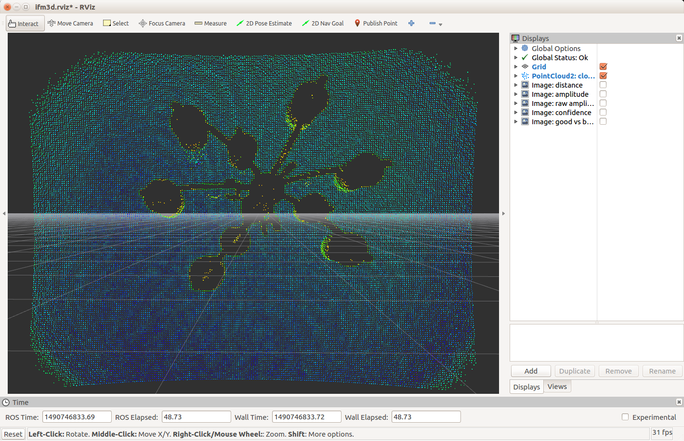

Building and Installing the ifm3d-ros Package
---------------------------------------------

### Prerequisites

1. [Ubuntu 16.04 LTS](http://www.ubuntu.com)
2. [ROS Kinetic](http://www.ros.org/install) - we recommend `ros-kinetic-desktop-full`.
3. [ifm3d](https://github.com/lovepark/ifm3d) - version >= 0.9.0

or

1. [Ubuntu 18.04 LTS](http://www.ubuntu.com)
2. [ROS Melodic](http://www.ros.org/install) - we recommend `ros-melodic-desktop-full`.
3. [ifm3d](https://github.com/lovepark/ifm3d) - version >= 0.9.2

### Step-by-Step Build Instructions

Step-by-step instructions on getting a fresh installation of Ubuntu and ROS
prepared for usage with `ifm3d-ros` is available at the following links:
* [Ubuntu 16.04 with ROS Kinetic](kinetic.md)
* [Ubuntu 18.04 with ROS Melodic](melodic.md)

Building and installing ifm3d-ros is accomplished by utilizing the ROS
[catkin](http://wiki.ros.org/catkin) tool. There are many tutorials and other
pieces of advice available on-line advising how to most effectively utilize
catkin. However, the basic idea is to provide a clean separation between your
source code repository and your build and runtime environments. The
instructions that now follow represent how we choose to use catkin to build and
_permanently install_ a ROS package from source.

First, we need to decide where we want our software to ultimately be
installed. For purposes of this document, we will assume that we will install
our ROS packages at `~/ros`. For convenience, we add the following to our
`~/.bashrc`:

NOTE: Below we assume `kinetic`. Adapting to `melodic` is left as an exercise
for the reader.

```
if [ -f /opt/ros/kinetic/setup.bash ]; then
  source /opt/ros/kinetic/setup.bash
fi

cd ${HOME}

export LPR_ROS=${HOME}/ros

if [ -d ${LPR_ROS} ]; then
    for i in $(ls ${LPR_ROS}); do
        if [ -d ${LPR_ROS}/${i} ]; then
            if [ -f ${LPR_ROS}/${i}/setup.bash ]; then
                source ${LPR_ROS}/${i}/setup.bash --extend
            fi
        fi
    done
fi
```

Next, we need to get the code from github. We assume we keep all of our git
repositories in `~/dev`.

```
$ cd ~/dev
$ git clone https://github.com/lovepark/ifm3d-ros.git
```

We now have the code in `~/dev/ifm3d-ros`. Next, we want to create a _catkin
workspace_ that we can use to build and install that code from. It is the
catkin philosophy that we do not do this directly in the source directory.

```
$ cd ~/catkin
$ mkdir ifm3d
$ cd ifm3d
$ mkdir src
$ cd src
$ catkin_init_workspace
$ ln -s ~/dev/ifm3d-ros ifm3d
```

So, you should have a catkin workspace set up to build the ifm3d-ros code that
looks basically like:

```
[ ~/catkin/ifm3d/src ]
tpanzarella@tuna: $ pwd
/home/tpanzarella/catkin/ifm3d/src

[ ~/catkin/ifm3d/src ]
tpanzarella@tuna: $ ls -l
total 0
lrwxrwxrwx 1 tpanzarella tpanzarella 50 Mar 26 15:16 CMakeLists.txt -> /opt/ros/kinetic/share/catkin/cmake/toplevel.cmake
lrwxrwxrwx 1 tpanzarella tpanzarella 31 Mar 26 15:16 ifm3d -> /home/tpanzarella/dev/ifm3d-ros
```

Now we are ready to build the code.

```
$ cd ~/catkin/ifm3d
$ catkin_make -DCATKIN_ENABLE_TESTING=ON
$ catkin_make run_tests
$ catkin_make -DCMAKE_INSTALL_PREFIX=${LPR_ROS}/ifm3d install
```

The ROS package should now be installed in `~/ros/ifm3d`. To test everything
out you should open a fresh bash shell, and start up a ROS core:

    $ roscore

Open another shell and start the primary camera node:

    $ roslaunch ifm3d camera.launch

Open another shell and start the rviz node to visualize the data coming from
the camera:

    $ roslaunch ifm3d rviz.launch

At this point, you should see an rviz window that looks something like:



Congratulations! You can now utilize ifm3d-ros.
