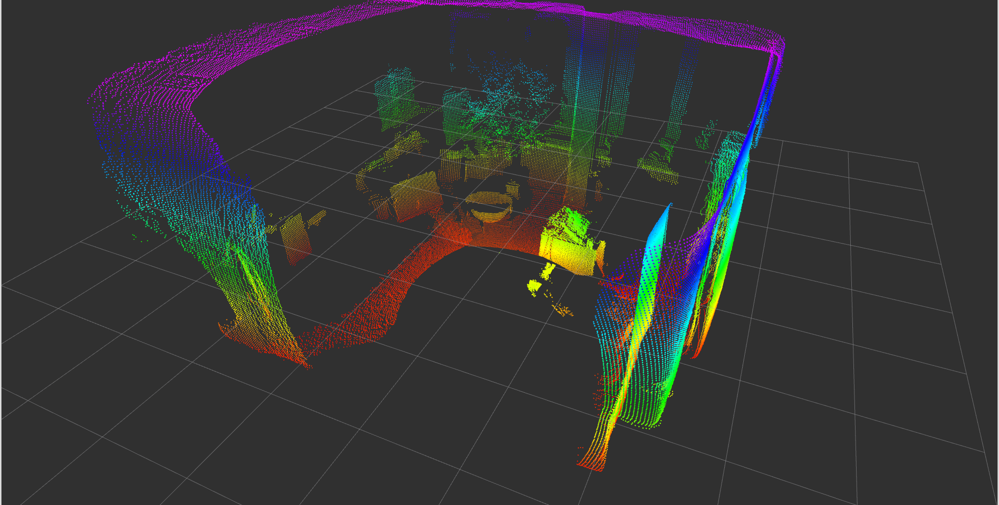

# Building and Installing the ifm3d-ros package
## Prerequisites

We suggest to build the `ifm3d-ros` node on top of Ubuntu 20.04 and ROS noetic.
If you have reached this document via the [noetic ifm3d building instructions](noetic.md) and followed all the major steps in there you can skip the three steps listed below. They are just a short repetition.
1. [Ubuntu 20.04 LTS](http://www.ubuntu.com)
2. [ROS Noetic](http://wiki.ros.org/noetic/Installation/) - we recommend `ros-noetic-desktop-full`.
3. [ifm3d](https://github.com/ifm/ifm3d)


> **NOTE**: Some users may require older ROS distributions for legacy reasons. The supplied ROS package may very well work with limited changes on older ROS distributions. At least previous version could be run as far back as Indigo and Kinetic. However, we didn't test this ourselves. Please be aware that if you chose to go this route no guarantee is given.

## Step-by-Step build instructions for the ROS node `ifm3d-ros`

Building and installing ifm3d-ros is accomplished by utilizing the ROS [catkin](http://wiki.ros.org/catkin) tool. There are many tutorials and other pieces of advice available online advising how to most effectively utilize catkin. The instructions that now follow represent how we choose to use catkin to build and _permanently install_ a ROS package from source.

**Alternatively: If you are looking for independent sub-package build  - please see [distributed build instructions](distributed_build.md)**

### Installation directory of ROS node
First, we need to decide where we want our software to be installed. For purposes of this document, we will assume that we will install our ROS packages at `~/catkin_ws/src`.

>**NOTE**: Below we assume `noetic`. Adapting to other ROS distributions is left as an exercise for the reader.

### Create and initialize your catkin workspace
Next, we want to create a _catkin workspace_ that we can use to build and install that code from.
For further information about setting up you _catkin workspace_ please see this documentation: [create a catkin workspace](http://wiki.ros.org/catkin/Tutorials/create_a_workspace).
```
$ mkdir -p ~/catkin_ws/src && cd ~/catkin_ws/src
$ catkin_init_workspace
```

### Get the `ifm3d-ros` wrapper code from GitHub
Next, we need to get the code from GitHub. Please adapt the commands when not following the suggested directory structure: `~/catkin_ws/src/`

> **NOTE**: that the `master` branch is generally a work in progress. Please use a  {{ '[tagged release]({})'.format(ifm3d_ros_latest_tag_url) }}.
```
$ cd ~/catkin_ws/src
$ git clone https://github.com/ifm/ifm3d-ros.git
```

So, you should have a catkin workspace set up to build the ifm3d-ros code that looks similar to this:
```
[ ~/catkin_ws/src ]
rosuser@tuna: $ pwd
/home/rosuser/catkin_ws/src

[ ~/catkin_ws/src/ifm3d-ros ]
rosuser@tuna: $ ls -l
total 0
lrwxrwxrwx 1 rosuser rosuser 50 Mar 26 15:16 CMakeLists.txt -> /opt/ros/noetic/share/catkin_ws/cmake/toplevel.cmake
lrwxrwxrwx 1 rosuser rosuser 31 Mar 26 15:16 ifm3d-ros
```

### Build the ROS node
Now we are ready to build the code. The following code block shows you how to simply run catkin_make without anything else happening further.
```
$ cd ~/catkin_ws/
$ catkin_make
```
This will create a `devel` and `build` folder in your catkin workspace, which contains the required code for running the ROS node. To test this you can easily set-up your current shell and run: `source ~/catkin_ws/devel/setup.bash && roslaunch ifm3d_ros_examples camera.launch`.


The ROS package should now be installed in `~/ros/ifm3d-ros`. To test everything out you should open a fresh bash shell, and start up a ROS core:
(Please don't forget to source the ifm3d-ros package first if you haven't done it yet.)
```
$ roscore &
$ roslaunch ifm3d_ros_examples camera.launch
```

> **NOTE**: This example expects the camera on PCIC port 50010. You can change the default value with `pcic_port`.

Open another shell and start the rviz node to visualize the data coming from the camera:
```
$ roslaunch ifm3d_ros_examples rviz.launch
```
> **NOTE**: `rviz.launch` does not include the camera node itself, but subscribes to published topics (distance, amplitude, etc). A camera node need to be running in parallel to rviz (you can use `camera.launch`).

At this point, you should see an rviz window that looks something like the image below (note that this is the view from 3 camera heads):


Congratulations! You can now have complete control over the O3R perception platform from inside ROS.


## Building subpackages
Please see [this documentation](distributed_build.md) for how to build some of the subpackages for distributed systems.
