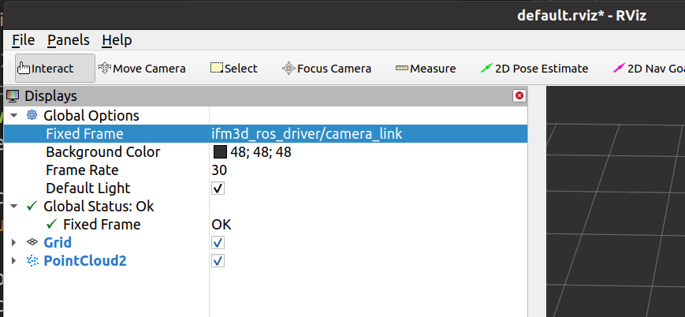

## HOW to visualize the point cloud with RVIZ
The included launch file `camera.launch` will publish and remap all topics and services to `/ifm3d_ros_driver/xxx`, for example the point cloud topic will be remapped to `/ifm3d_ros_driver/camera/cloud`.  

When you open RVIZ for the first time and subscribe the point cloud topic to it, it will not be displayed as the transformation chain between the different reference frames is not complete.

The first option is to use a "dummy" a static transform publisher to fix the missing link in the pose transformation chain:  

Open a new shell and run this simple `static_transform_publisher` to map the `ifm3d/camera_link` to the `map` frame.
```
rosrun tf2_ros static_transform_publisher 1 0 0 0 0 0 map ifm3d/camera_link
```

The second option is to pick a different reference frame in the Rviz options:



### Change axis directions to suit your interpretation of a robot coordinate reference system
We have removed the rotation parameter which have been part of the `nodelet.launch` launch file which move the axis directions around. This decision was reached because we believe there should be only one place to change the extrinsic parameters to keep things unambiguous.  
We suggest changing the extrinsic parameters via our JSON interface (see ifm3d) and the mapped dump and config ROS services for this. The extrinsic parameters are applied to every measurement (distance image, and point cloud).  

If you would still like to add a `tf publisher` which switches the X-, and Z-axis please see the example below. Afterwards the Z-axis will measure positive values in the direction of the center optical ray of each camera.
```
 <node pkg="tf2_ros"
        type="static_transform_publisher"
        name="$(arg camera)_tf"
        args="0 0 0 -1.5707963267948966 0 -1.5707963267948966 $(arg frame_id_base)_link $(arg frame_id_base)_optical_link"
        respawn="$(arg respawn)" />
```
